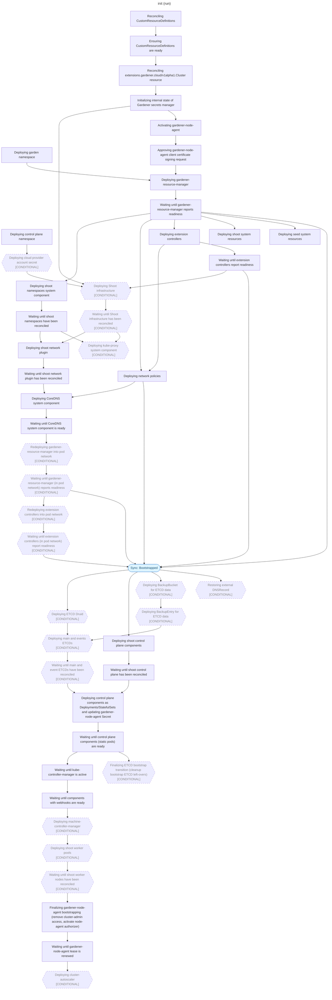

<!-- This file is auto-generated via `make generate`. DO NOT EDIT. -->

# init

```mermaid
---
title: init (run)
---
flowchart TD
    classDef conditional stroke-dasharray:5 5,color:#888
    classDef syncpoint fill:#ddf4ff,stroke:#4a90d9,color:#1a5276

    DeployingControlPlaneNamespace["Deploying control plane namespace"]
    DeployingGardenNamespace["Deploying garden namespace"]
    DeployingCloudProviderAccountSecret{{"Deploying cloud provider account secret\n[CONDITIONAL]"}}:::conditional
    ReconcilingCustomResourceDefinitions["Reconciling CustomResourceDefinitions"]
    EnsuringCustomResourceDefinitionsAreReady["Ensuring CustomResourceDefinitions are ready"]
    ReconcilingExtensionsgardenercloudV1alpha1ClusterResource["Reconciling extensions.gardener.cloud/v1alpha1.Cluster resource"]
    InitializingInternalStateOfGardenerSecretsManager["Initializing internal state of Gardener secrets manager"]
    ActivatingGardenerNodeAgent["Activating gardener-node-agent"]
    ApprovingGardenerNodeAgentClientCertificateSigningRequest["Approving gardener-node-agent client certificate signing request"]
    DeployingGardenerResourceManager["Deploying gardener-resource-manager"]
    WaitingUntilGardenerResourceManagerReportsReadiness["Waiting until gardener-resource-manager reports readiness"]
    DeployingSeedSystemResources["Deploying seed system resources"]
    DeployingShootSystemResources["Deploying shoot system resources"]
    DeployingExtensionControllers["Deploying extension controllers"]
    WaitingUntilExtensionControllersReportReadiness["Waiting until extension controllers report readiness"]
    DeployingNetworkPolicies["Deploying network policies"]
    DeployingShootInfrastructure{{"Deploying Shoot infrastructure\n[CONDITIONAL]"}}:::conditional
    WaitingUntilShootInfrastructureHasBeenReconciled{{"Waiting until Shoot infrastructure has been reconciled\n[CONDITIONAL]"}}:::conditional
    DeployingShootNamespacesSystemComponent["Deploying shoot namespaces system component"]
    WaitingUntilShootNamespacesHaveBeenReconciled["Waiting until shoot namespaces have been reconciled"]
    DeployingKubeProxySystemComponent{{"Deploying kube-proxy system component\n[CONDITIONAL]"}}:::conditional
    DeployingShootNetworkPlugin["Deploying shoot network plugin"]
    WaitingUntilShootNetworkPluginHasBeenReconciled["Waiting until shoot network plugin has been reconciled"]
    DeployingCoreDNSSystemComponent["Deploying CoreDNS system component"]
    WaitingUntilCoreDNSSystemComponentIsReady["Waiting until CoreDNS system component is ready"]
    RedeployingGardenerResourceManagerIntoPodNetwork{{"Redeploying gardener-resource-manager into pod network\n[CONDITIONAL]"}}:::conditional
    WaitingUntilGardenerResourceManagerInPodNetworkReportsReadiness{{"Waiting until gardener-resource-manager (in pod network) reports readiness\n[CONDITIONAL]"}}:::conditional
    RedeployingExtensionControllersIntoPodNetwork{{"Redeploying extension controllers into pod network\n[CONDITIONAL]"}}:::conditional
    WaitingUntilExtensionControllersInPodNetworkReportReadiness{{"Waiting until extension controllers (in pod network) report readiness\n[CONDITIONAL]"}}:::conditional
    RestoringExternalDNSRecord{{"Restoring external DNSRecord\n[CONDITIONAL]"}}:::conditional
    DeployingBackupBucketForETCDData{{"Deploying BackupBucket for ETCD data\n[CONDITIONAL]"}}:::conditional
    DeployingBackupEntryForETCDData{{"Deploying BackupEntry for ETCD data\n[CONDITIONAL]"}}:::conditional
    DeployingShootControlPlaneComponents["Deploying shoot control plane components"]
    WaitingUntilShootControlPlaneHasBeenReconciled["Waiting until shoot control plane has been reconciled"]
    DeployingETCDDruid{{"Deploying ETCD Druid\n[CONDITIONAL]"}}:::conditional
    DeployingMainAndEventsETCDs{{"Deploying main and events ETCDs\n[CONDITIONAL]"}}:::conditional
    WaitingUntilMainAndEventETCDsHaveBeenReconciled{{"Waiting until main and event ETCDs have been reconciled\n[CONDITIONAL]"}}:::conditional
    DeployingControlPlaneComponentsAsDeploymentsStatefulSetsAndUpdatingGardenerNodeAgentSecret["Deploying control plane components as Deployments/StatefulSets and updating gardener-node-agent Secret"]
    WaitingUntilControlPlaneComponentsStaticPodsAreReady["Waiting until control plane components (static pods) are ready"]
    FinalizingETCDBootstrapTransitionCleanupBootstrapETCDLeftOvers{{"Finalizing ETCD bootstrap transition (cleanup bootstrap ETCD left-overs)\n[CONDITIONAL]"}}:::conditional
    WaitingUntilKubeControllerManagerIsActive["Waiting until kube-controller-manager is active"]
    WaitingUntilComponentsWithWebhooksAreReady["Waiting until components with webhooks are ready"]
    DeployingMachineControllerManager{{"Deploying machine-controller-manager\n[CONDITIONAL]"}}:::conditional
    DeployingShootWorkerPools{{"Deploying shoot worker pools\n[CONDITIONAL]"}}:::conditional
    WaitingUntilShootWorkerNodesHaveBeenReconciled{{"Waiting until shoot worker nodes have been reconciled\n[CONDITIONAL]"}}:::conditional
    FinalizingGardenerNodeAgentBootstrappingRemoveClusterAdminAccessActivateNodeAgentAuthorizer["Finalizing gardener-node-agent bootstrapping (remove cluster-admin access, activate node-agent authorizer)"]
    WaitingUntilGardenerNodeAgentLeaseIsRenewed["Waiting until gardener-node-agent lease is renewed"]
    DeployingClusterAutoscaler{{"Deploying cluster-autoscaler\n[CONDITIONAL]"}}:::conditional
    SyncPointBootstrapped(["Sync: Bootstrapped"]):::syncpoint

    DeployingNetworkPolicies --> SyncPointBootstrapped
    WaitingUntilGardenerResourceManagerReportsReadiness --> SyncPointBootstrapped
    WaitingUntilGardenerResourceManagerInPodNetworkReportsReadiness --> SyncPointBootstrapped
    WaitingUntilExtensionControllersReportReadiness --> SyncPointBootstrapped
    WaitingUntilExtensionControllersInPodNetworkReportReadiness --> SyncPointBootstrapped
    DeployingControlPlaneNamespace --> DeployingCloudProviderAccountSecret
    ReconcilingCustomResourceDefinitions --> EnsuringCustomResourceDefinitionsAreReady
    EnsuringCustomResourceDefinitionsAreReady --> ReconcilingExtensionsgardenercloudV1alpha1ClusterResource
    ReconcilingExtensionsgardenercloudV1alpha1ClusterResource --> InitializingInternalStateOfGardenerSecretsManager
    InitializingInternalStateOfGardenerSecretsManager --> ActivatingGardenerNodeAgent
    ActivatingGardenerNodeAgent --> ApprovingGardenerNodeAgentClientCertificateSigningRequest
    ApprovingGardenerNodeAgentClientCertificateSigningRequest --> DeployingGardenerResourceManager
    DeployingGardenNamespace --> DeployingGardenerResourceManager
    DeployingGardenerResourceManager --> WaitingUntilGardenerResourceManagerReportsReadiness
    WaitingUntilGardenerResourceManagerReportsReadiness --> DeployingSeedSystemResources
    WaitingUntilGardenerResourceManagerReportsReadiness --> DeployingShootSystemResources
    WaitingUntilGardenerResourceManagerReportsReadiness --> DeployingExtensionControllers
    DeployingExtensionControllers --> WaitingUntilExtensionControllersReportReadiness
    WaitingUntilGardenerResourceManagerReportsReadiness --> DeployingNetworkPolicies
    DeployingExtensionControllers --> DeployingNetworkPolicies
    InitializingInternalStateOfGardenerSecretsManager --> DeployingShootInfrastructure
    DeployingCloudProviderAccountSecret --> DeployingShootInfrastructure
    WaitingUntilExtensionControllersReportReadiness --> DeployingShootInfrastructure
    DeployingShootInfrastructure --> WaitingUntilShootInfrastructureHasBeenReconciled
    WaitingUntilGardenerResourceManagerReportsReadiness --> DeployingShootNamespacesSystemComponent
    DeployingShootNamespacesSystemComponent --> WaitingUntilShootNamespacesHaveBeenReconciled
    WaitingUntilShootNamespacesHaveBeenReconciled --> DeployingKubeProxySystemComponent
    WaitingUntilShootInfrastructureHasBeenReconciled --> DeployingKubeProxySystemComponent
    WaitingUntilShootNamespacesHaveBeenReconciled --> DeployingShootNetworkPlugin
    WaitingUntilShootInfrastructureHasBeenReconciled --> DeployingShootNetworkPlugin
    DeployingShootNetworkPlugin --> WaitingUntilShootNetworkPluginHasBeenReconciled
    WaitingUntilShootNetworkPluginHasBeenReconciled --> DeployingCoreDNSSystemComponent
    DeployingNetworkPolicies --> DeployingCoreDNSSystemComponent
    DeployingCoreDNSSystemComponent --> WaitingUntilCoreDNSSystemComponentIsReady
    WaitingUntilCoreDNSSystemComponentIsReady --> RedeployingGardenerResourceManagerIntoPodNetwork
    RedeployingGardenerResourceManagerIntoPodNetwork --> WaitingUntilGardenerResourceManagerInPodNetworkReportsReadiness
    WaitingUntilGardenerResourceManagerInPodNetworkReportsReadiness --> RedeployingExtensionControllersIntoPodNetwork
    RedeployingExtensionControllersIntoPodNetwork --> WaitingUntilExtensionControllersInPodNetworkReportReadiness
    SyncPointBootstrapped --> RestoringExternalDNSRecord
    SyncPointBootstrapped --> DeployingBackupBucketForETCDData
    DeployingBackupBucketForETCDData --> DeployingBackupEntryForETCDData
    SyncPointBootstrapped --> DeployingShootControlPlaneComponents
    DeployingShootControlPlaneComponents --> WaitingUntilShootControlPlaneHasBeenReconciled
    SyncPointBootstrapped --> DeployingETCDDruid
    DeployingETCDDruid --> DeployingMainAndEventsETCDs
    DeployingBackupEntryForETCDData --> DeployingMainAndEventsETCDs
    DeployingMainAndEventsETCDs --> WaitingUntilMainAndEventETCDsHaveBeenReconciled
    WaitingUntilShootControlPlaneHasBeenReconciled --> DeployingControlPlaneComponentsAsDeploymentsStatefulSetsAndUpdatingGardenerNodeAgentSecret
    WaitingUntilMainAndEventETCDsHaveBeenReconciled --> DeployingControlPlaneComponentsAsDeploymentsStatefulSetsAndUpdatingGardenerNodeAgentSecret
    DeployingControlPlaneComponentsAsDeploymentsStatefulSetsAndUpdatingGardenerNodeAgentSecret --> WaitingUntilControlPlaneComponentsStaticPodsAreReady
    WaitingUntilControlPlaneComponentsStaticPodsAreReady --> FinalizingETCDBootstrapTransitionCleanupBootstrapETCDLeftOvers
    WaitingUntilControlPlaneComponentsStaticPodsAreReady --> WaitingUntilKubeControllerManagerIsActive
    WaitingUntilKubeControllerManagerIsActive --> WaitingUntilComponentsWithWebhooksAreReady
    WaitingUntilComponentsWithWebhooksAreReady --> DeployingMachineControllerManager
    DeployingMachineControllerManager --> DeployingShootWorkerPools
    DeployingShootWorkerPools --> WaitingUntilShootWorkerNodesHaveBeenReconciled
    WaitingUntilShootWorkerNodesHaveBeenReconciled --> FinalizingGardenerNodeAgentBootstrappingRemoveClusterAdminAccessActivateNodeAgentAuthorizer
    FinalizingGardenerNodeAgentBootstrappingRemoveClusterAdminAccessActivateNodeAgentAuthorizer --> WaitingUntilGardenerNodeAgentLeaseIsRenewed
    WaitingUntilGardenerNodeAgentLeaseIsRenewed --> DeployingClusterAutoscaler
```
