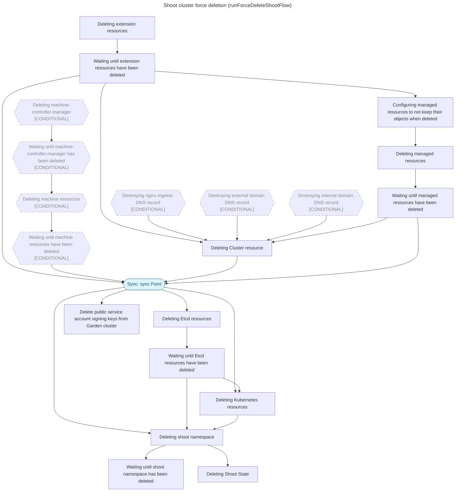

<!-- This file is auto-generated via `make generate`. DO NOT EDIT. -->

# Shoot cluster force deletion

```mermaid
---
title: Shoot cluster force deletion (runForceDeleteShootFlow)
---
flowchart TD
    classDef conditional stroke-dasharray:5 5,color:#888
    classDef syncpoint fill:#ddf4ff,stroke:#4a90d9,color:#1a5276

    DeletingExtensionResources["Deleting extension resources"]
    WaitingUntilExtensionResourcesHaveBeenDeleted["Waiting until extension resources have been deleted"]
    DestroyingNginxIngressDNSRecord{{"Destroying nginx ingress DNS record\n[CONDITIONAL]"}}:::conditional
    DestroyingExternalDomainDNSRecord{{"Destroying external domain DNS record\n[CONDITIONAL]"}}:::conditional
    DestroyingInternalDomainDNSRecord{{"Destroying internal domain DNS record\n[CONDITIONAL]"}}:::conditional
    DeletingMachineControllerManager{{"Deleting machine-controller-manager\n[CONDITIONAL]"}}:::conditional
    WaitingUntilMachineControllerManagerHasBeenDeleted{{"Waiting until machine-controller-manager has been deleted\n[CONDITIONAL]"}}:::conditional
    DeletingMachineResources{{"Deleting machine resources\n[CONDITIONAL]"}}:::conditional
    WaitingUntilMachineResourcesHaveBeenDeleted{{"Waiting until machine resources have been deleted\n[CONDITIONAL]"}}:::conditional
    ConfiguringManagedResourcesToNotKeepTheirObjectsWhenDeleted["Configuring managed resources to not keep their objects when deleted"]
    DeletingManagedResources["Deleting managed resources"]
    WaitingUntilManagedResourcesHaveBeenDeleted["Waiting until managed resources have been deleted"]
    DeletingClusterResource["Deleting Cluster resource"]
    DeletingEtcdResources["Deleting Etcd resources"]
    WaitingUntilEtcdResourcesHaveBeenDeleted["Waiting until Etcd resources have been deleted"]
    DeletingKubernetesResources["Deleting Kubernetes resources"]
    DeletingShootNamespace["Deleting shoot namespace"]
    DeletePublicServiceAccountSigningKeysFromGardenCluster["Delete public service account signing keys from Garden cluster"]
    WaitingUntilShootNamespaceHasBeenDeleted["Waiting until shoot namespace has been deleted"]
    DeletingShootState["Deleting Shoot State"]
    SyncPoint(["Sync: sync Point"]):::syncpoint

    WaitingUntilExtensionResourcesHaveBeenDeleted --> SyncPoint
    WaitingUntilMachineResourcesHaveBeenDeleted --> SyncPoint
    DeletingClusterResource --> SyncPoint
    WaitingUntilManagedResourcesHaveBeenDeleted --> SyncPoint
    DeletingExtensionResources --> WaitingUntilExtensionResourcesHaveBeenDeleted
    DeletingMachineControllerManager --> WaitingUntilMachineControllerManagerHasBeenDeleted
    WaitingUntilMachineControllerManagerHasBeenDeleted --> DeletingMachineResources
    DeletingMachineResources --> WaitingUntilMachineResourcesHaveBeenDeleted
    WaitingUntilExtensionResourcesHaveBeenDeleted --> ConfiguringManagedResourcesToNotKeepTheirObjectsWhenDeleted
    ConfiguringManagedResourcesToNotKeepTheirObjectsWhenDeleted --> DeletingManagedResources
    DeletingManagedResources --> WaitingUntilManagedResourcesHaveBeenDeleted
    WaitingUntilExtensionResourcesHaveBeenDeleted --> DeletingClusterResource
    DestroyingNginxIngressDNSRecord --> DeletingClusterResource
    DestroyingExternalDomainDNSRecord --> DeletingClusterResource
    DestroyingInternalDomainDNSRecord --> DeletingClusterResource
    WaitingUntilManagedResourcesHaveBeenDeleted --> DeletingClusterResource
    SyncPoint --> DeletingEtcdResources
    DeletingEtcdResources --> WaitingUntilEtcdResourcesHaveBeenDeleted
    SyncPoint --> DeletingKubernetesResources
    WaitingUntilEtcdResourcesHaveBeenDeleted --> DeletingKubernetesResources
    SyncPoint --> DeletingShootNamespace
    WaitingUntilEtcdResourcesHaveBeenDeleted --> DeletingShootNamespace
    DeletingKubernetesResources --> DeletingShootNamespace
    SyncPoint --> DeletePublicServiceAccountSigningKeysFromGardenCluster
    DeletingShootNamespace --> WaitingUntilShootNamespaceHasBeenDeleted
    DeletingShootNamespace --> DeletingShootState
```
