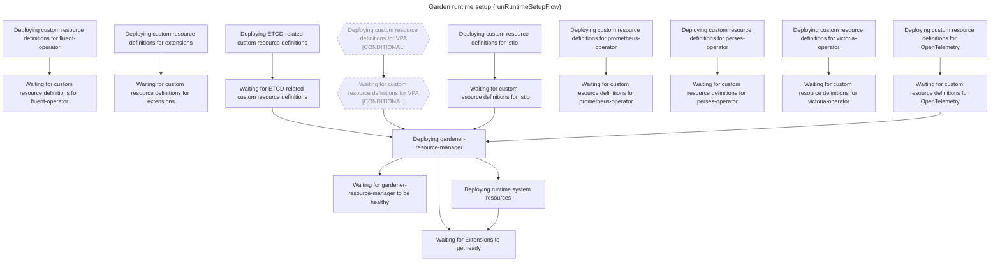

<!-- This file is auto-generated via `make generate`. DO NOT EDIT. -->

# Garden runtime setup

```mermaid
---
title: Garden runtime setup (runRuntimeSetupFlow)
---
flowchart TD
    classDef conditional stroke-dasharray:5 5,color:#888
    classDef syncpoint fill:#ddf4ff,stroke:#4a90d9,color:#1a5276

    DeployingCustomResourceDefinitionsForFluentOperator["Deploying custom resource definitions for fluent-operator"]
    DeployingCustomResourceDefinitionsForPrometheusOperator["Deploying custom resource definitions for prometheus-operator"]
    DeployingCustomResourceDefinitionsForPersesOperator["Deploying custom resource definitions for perses-operator"]
    DeployingCustomResourceDefinitionsForVictoriaOperator["Deploying custom resource definitions for victoria-operator"]
    DeployingCustomResourceDefinitionsForExtensions["Deploying custom resource definitions for extensions"]
    DeployingETCDRelatedCustomResourceDefinitions["Deploying ETCD-related custom resource definitions"]
    DeployingCustomResourceDefinitionsForVPA{{"Deploying custom resource definitions for VPA\n[CONDITIONAL]"}}:::conditional
    DeployingCustomResourceDefinitionsForIstio["Deploying custom resource definitions for Istio"]
    DeployingCustomResourceDefinitionsForOpenTelemetry["Deploying custom resource definitions for OpenTelemetry"]
    WaitingForCustomResourceDefinitionsForFluentOperator["Waiting for custom resource definitions for fluent-operator"]
    WaitingForCustomResourceDefinitionsForExtensions["Waiting for custom resource definitions for extensions"]
    WaitingForETCDRelatedCustomResourceDefinitions["Waiting for ETCD-related custom resource definitions"]
    WaitingForCustomResourceDefinitionsForVPA{{"Waiting for custom resource definitions for VPA\n[CONDITIONAL]"}}:::conditional
    WaitingForCustomResourceDefinitionsForIstio["Waiting for custom resource definitions for Istio"]
    WaitingForCustomResourceDefinitionsForPrometheusOperator["Waiting for custom resource definitions for prometheus-operator"]
    WaitingForCustomResourceDefinitionsForPersesOperator["Waiting for custom resource definitions for perses-operator"]
    WaitingForCustomResourceDefinitionsForVictoriaOperator["Waiting for custom resource definitions for victoria-operator"]
    WaitingForCustomResourceDefinitionsForOpenTelemetry["Waiting for custom resource definitions for OpenTelemetry"]
    DeployingGardenerResourceManager["Deploying gardener-resource-manager"]
    WaitingForGardenerResourceManagerToBeHealthy["Waiting for gardener-resource-manager to be healthy"]
    DeployingRuntimeSystemResources["Deploying runtime system resources"]
    WaitingForExtensionsToGetReady["Waiting for Extensions to get ready"]

    DeployingCustomResourceDefinitionsForFluentOperator --> WaitingForCustomResourceDefinitionsForFluentOperator
    DeployingCustomResourceDefinitionsForExtensions --> WaitingForCustomResourceDefinitionsForExtensions
    DeployingETCDRelatedCustomResourceDefinitions --> WaitingForETCDRelatedCustomResourceDefinitions
    DeployingCustomResourceDefinitionsForVPA --> WaitingForCustomResourceDefinitionsForVPA
    DeployingCustomResourceDefinitionsForIstio --> WaitingForCustomResourceDefinitionsForIstio
    DeployingCustomResourceDefinitionsForPrometheusOperator --> WaitingForCustomResourceDefinitionsForPrometheusOperator
    DeployingCustomResourceDefinitionsForPersesOperator --> WaitingForCustomResourceDefinitionsForPersesOperator
    DeployingCustomResourceDefinitionsForVictoriaOperator --> WaitingForCustomResourceDefinitionsForVictoriaOperator
    DeployingCustomResourceDefinitionsForOpenTelemetry --> WaitingForCustomResourceDefinitionsForOpenTelemetry
    WaitingForETCDRelatedCustomResourceDefinitions --> DeployingGardenerResourceManager
    WaitingForCustomResourceDefinitionsForVPA --> DeployingGardenerResourceManager
    WaitingForCustomResourceDefinitionsForIstio --> DeployingGardenerResourceManager
    WaitingForCustomResourceDefinitionsForOpenTelemetry --> DeployingGardenerResourceManager
    DeployingGardenerResourceManager --> WaitingForGardenerResourceManagerToBeHealthy
    DeployingGardenerResourceManager --> DeployingRuntimeSystemResources
    DeployingGardenerResourceManager --> WaitingForExtensionsToGetReady
    DeployingRuntimeSystemResources --> WaitingForExtensionsToGetReady
```
